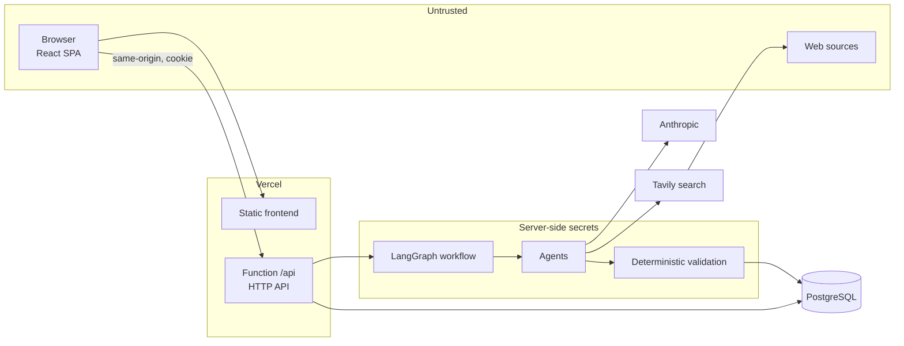
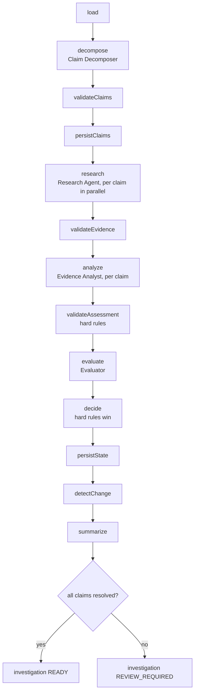
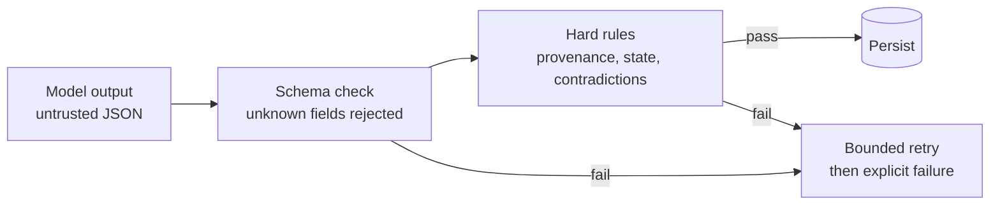
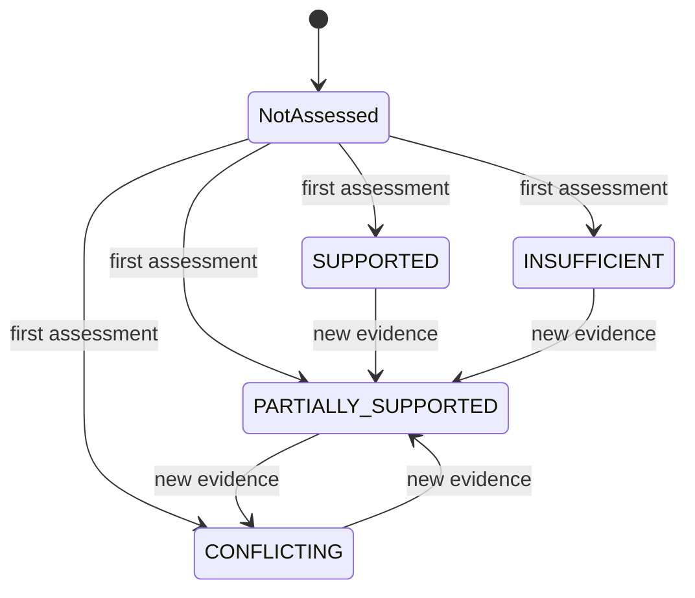
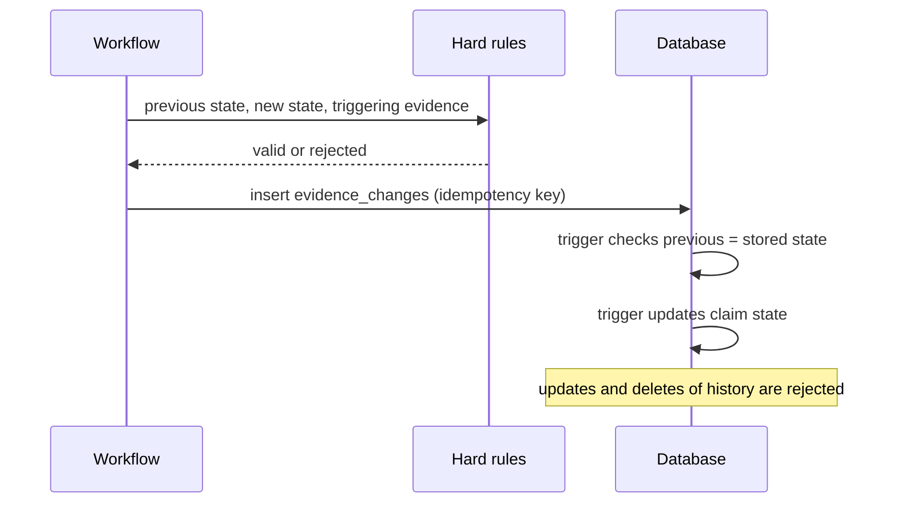
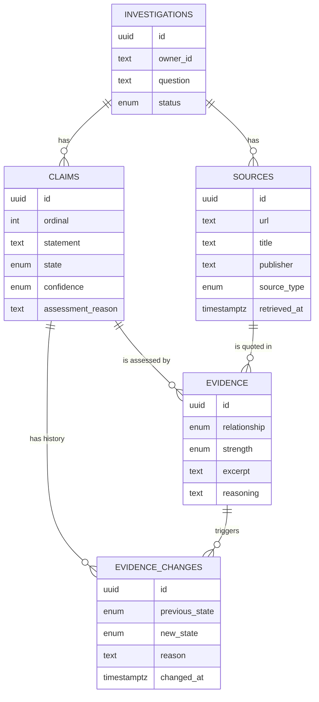
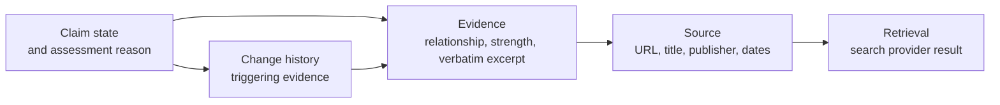

# Diagrams

Mermaid diagrams of the system as built (GitHub and most Markdown viewers render them). They show what the code does today; Momen is deferred ([ADR-010](adr/ADR-010-postgresql-direct-backend.md)).

## 1. System context and trust boundaries

Retrieved source text is untrusted data. Provider keys and `DATABASE_URL` exist only on the server side.

## 2. Workflow

Transient failures are retried at most twice. A failure on one claim is recorded without discarding the others. An authentication or authorization failure, or a crash, marks the investigation `ERROR`.

## 3. Agent output path

## 4. Claim state and change

The first state is stored directly. Every later change must be an `evidence_changes` record with a previous state equal to the stored state, a different new state and triggering evidence that belongs to the claim and is new in the run. The arrows above show examples, not a closed list: any state change that meets those conditions is allowed, and an unchanged state creates no record. Confidence is a separate field and is not part of this diagram.

## 5. Data model

Foreign keys are `ON DELETE RESTRICT`. Evidence must reference a claim and a source of the same investigation. `evidence_changes` is append-only.

## 6. Provenance chain

Every link is a persisted record, and the UI navigates it. The model never supplies the source fields at the end of the chain. The analyst's list of cited evidence ids is validated at run time but is not stored as its own record; the persisted trail is the claim's evidence, its assessment reason and the history.
